# Ephemeral P2P Chat - Technical Design Document

Status: Draft  
Document type: RFC-style engineering design  
Audience: frontend engineers, security reviewers, maintainers, QA engineers  
Primary implementation stack: React, TypeScript, TailwindCSS, Vite, WebRTC DataChannels, Web Crypto API  

## Table of Contents

1. [Executive Summary](#chapter-1---executive-summary)
2. [Functional Requirements](#chapter-2---functional-requirements)
3. [Non Functional Requirements](#chapter-3---non-functional-requirements)
4. [System Architecture](#chapter-4---system-architecture)
5. [Technology Decisions](#chapter-5---technology-decisions)
6. [Session Lifecycle](#chapter-6---session-lifecycle)
7. [QR Protocol](#chapter-7---qr-protocol)
8. [Networking](#chapter-8---networking)
9. [Cryptography](#chapter-9---cryptography)
10. [Message Protocol](#chapter-10---message-protocol)
11. [File Transfer](#chapter-11---file-transfer)
12. [Memory Management](#chapter-12---memory-management)
13. [Threat Model](#chapter-13---threat-model)
14. [Security Analysis](#chapter-14---security-analysis)
15. [Privacy Model](#chapter-15---privacy-model)
16. [Error Handling](#chapter-16---error-handling)
17. [APIs](#chapter-17---apis)
18. [Frontend Architecture](#chapter-18---frontend-architecture)
19. [State Machines](#chapter-19---state-machines)
20. [Sequence Diagrams](#chapter-20---sequence-diagrams)
21. [Testing](#chapter-21---testing)
22. [Deployment](#chapter-22---deployment)
23. [Development Roadmap](#chapter-23---development-roadmap)
24. [Open Source](#chapter-24---open-source)
25. [Future Research](#chapter-25---future-research)
26. [Appendix](#appendix)

---

## Chapter 1 - Executive Summary

### Purpose

Ephemeral P2P Chat is a privacy-first web messaging application for temporary peer-to-peer conversations. Users create or join a session from a browser, exchange a QR code or manual invitation string, and communicate directly over WebRTC DataChannels. The application avoids user accounts, databases, message history, analytics, cloud storage, and persistent local storage.

The product is designed for short-lived conversations where privacy, simplicity, and data minimization matter more than long-term reachability or durable history. A session exists only while peers are connected and the page remains active. Once the session is destroyed or expires, application state is erased from memory.

### Goals

- Provide direct browser-to-browser chat using WebRTC DataChannels.
- Encrypt all application payloads end to end using Web Crypto API.
- Avoid permanent backend infrastructure for normal operation.
- Support QR-based joining and manual invitation exchange.
- Support text messages, image messages, file transfer, typing indicators, acknowledgements, pings, and explicit session destruction.
- Keep all runtime state in memory only.
- Support multiple simultaneous sessions in a single browser tab.
- Provide a mobile-friendly, accessible, responsive user interface.
- Make the project open source, auditable, self-hostable, and easy to run as static files.

### Non-goals

- No user registration or identity provider integration.
- No persistent contacts, friend lists, or profiles.
- No durable message delivery when a peer is offline.
- No server-side message relay except optional signaling during connection setup.
- No cloud file storage.
- No analytics, telemetry, or tracking pixels.
- No synchronization across devices.
- No guarantee of hiding network metadata such as IP addresses.
- No protection against compromised browsers, operating systems, screen capture tools, or malicious extensions.

### Intended Users

The application is intended for users who need short-lived, low-friction, privacy-sensitive communication:

- Engineers sharing temporary secrets over a local network or video call.
- Journalists or researchers who need throwaway communication links.
- Friends or colleagues exchanging short-lived files without accounts.
- Privacy-conscious users who prefer browser-only tools with minimal infrastructure.
- Self-hosters who want an auditable static application.

### High-level Overview

One peer creates a session. The application generates an ephemeral key pair and a session invitation. The invitation is encoded as a QR code and as a manual string. A second peer scans the QR code or pastes the string. The peers exchange WebRTC signaling data either manually, through an optional signaling server, or through a local/LAN flow when supported. Once a WebRTC DataChannel is established, peers perform an application-level cryptographic handshake, derive symmetric keys, and exchange encrypted packets.

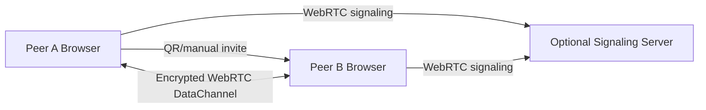

### Privacy Philosophy

The system follows data minimization:

- Do not collect data that is not needed.
- Do not persist data that can remain in memory.
- Do not create accounts when temporary sessions are enough.
- Do not make a server a trusted participant in conversations.
- Do not keep logs in the application layer.
- Make limitations explicit instead of implying anonymity that the browser stack cannot provide.

The application should be honest about privacy boundaries. It can protect message content from network observers and optional signaling infrastructure, but it cannot hide IP addresses from direct WebRTC peers without TURN relays, and it cannot protect content after it is displayed on a peer's screen.

### Key Architectural Principles

- **Local-first runtime:** all session state lives in browser memory.
- **Explicit lifetime:** sessions have creation, active, expired, destroyed, and cleaned-up states.
- **Small trusted computing base:** cryptographic and networking logic is isolated in narrow modules.
- **Protocol versioning:** QR payloads and packets include version fields.
- **Fail closed:** malformed, expired, oversized, replayed, or unauthenticated packets are rejected.
- **Progressive connectivity:** automatic signaling is optional; manual signaling remains possible.
- **User-verifiable pairing:** QR/manual invitation data binds the cryptographic session.
- **Composable sessions:** multiple independent sessions can run at the same time.

---

## Chapter 2 - Functional Requirements

### Requirement Format

Each feature is described by description, inputs, outputs, edge cases, and acceptance criteria.

### Session Creation

| Field | Detail |
|---|---|
| Description | A user can create a new temporary chat session. The app generates a session ID, cryptographic material, expiry timestamp, and invitation payload. |
| Inputs | User action: "new session"; optional expiry duration; optional display name; optional connectivity mode. |
| Outputs | Session object, QR payload, manual invite string, initial UI state. |
| Edge cases | Crypto API unavailable, entropy failure, too many sessions, unsupported browser, system clock skew. |
| Acceptance criteria | Session is created without writing to persistent storage; QR and manual string represent the same payload; expiry timer starts; session can be destroyed. |

Implementation notes:

- Generate `sessionId` using `crypto.getRandomValues`.
- Generate ephemeral ECDH key pair for application-level key exchange.
- Generate a short authentication code from the invitation fingerprint.
- Do not write session information to `localStorage`, `sessionStorage`, IndexedDB, Cache API, or cookies.

### Session Joining

| Field | Detail |
|---|---|
| Description | A user can join an existing session by scanning a QR code or entering a manual invitation string. |
| Inputs | QR payload or manual string; optional display name. |
| Outputs | Peer connection attempt, remote invitation metadata, join state. |
| Edge cases | Expired invitation, invalid checksum, unsupported protocol version, duplicate session, malformed base64, camera denied. |
| Acceptance criteria | Valid invitations transition to connection setup; invalid invitations show non-sensitive errors; no partial session remains after failure. |

### QR Generation

| Field | Detail |
|---|---|
| Description | The host can display a QR code containing the session invitation payload. |
| Inputs | Canonical invitation object. |
| Outputs | QR image or canvas; fallback manual string. |
| Edge cases | Payload too large, rendering failure, low contrast, screen too small. |
| Acceptance criteria | QR scans on common mobile devices; visual style has sufficient contrast; payload round trips exactly. |

### QR Scanning

| Field | Detail |
|---|---|
| Description | The joining peer can scan a QR code using the browser camera. |
| Inputs | Camera stream, user permission, QR frame. |
| Outputs | Decoded invitation payload or scan error. |
| Edge cases | Camera denied, no camera, multiple cameras, mirrored image, partial QR, repeated scans. |
| Acceptance criteria | Scanner asks for camera permission only on user action; camera stream is stopped after scan or cancel; decoded payload is validated before use. |

### Manual Session String

| Field | Detail |
|---|---|
| Description | Users can copy and paste a text invitation when QR scanning is unavailable. |
| Inputs | Encoded invitation string. |
| Outputs | Parsed invitation object. |
| Edge cases | Whitespace, line wrapping, Unicode confusables, truncated data, accidental extra text. |
| Acceptance criteria | Parser tolerates surrounding whitespace but rejects changed payloads; checksum catches accidental corruption; user can copy invitation with one command. |

### Text Messaging

| Field | Detail |
|---|---|
| Description | Peers can exchange encrypted UTF-8 text messages. |
| Inputs | Text content, active session, recipient peer. |
| Outputs | Encrypted `TEXT` packet, rendered local and remote message. |
| Edge cases | Empty message, overlong message, rapid sending, disconnected peer, unsupported characters. |
| Acceptance criteria | Messages are encrypted before transport; max size is enforced; send failure is surfaced; delivered messages appear in chronological order per peer. |

### Images

| Field | Detail |
|---|---|
| Description | Peers can send image files with preview metadata and optional thumbnail generation. |
| Inputs | Image file from picker, drag/drop, clipboard paste where supported. |
| Outputs | Metadata packet, chunk packets, reconstructed Blob URL. |
| Edge cases | Huge images, unsupported MIME, EXIF metadata, decode failure, memory pressure. |
| Acceptance criteria | Only allowed image MIME types are accepted; files are chunked; Blob URLs are revoked on cleanup; transfer can be cancelled. |

### Files

| Field | Detail |
|---|---|
| Description | Peers can transfer arbitrary files subject to configured limits. |
| Inputs | File object, active DataChannel, transfer confirmation. |
| Outputs | File metadata, chunks, progress state, reconstructed file Blob. |
| Edge cases | Large files, duplicate filenames, connection loss, sender cancellation, receiver rejection. |
| Acceptance criteria | User must explicitly choose files; receiver sees metadata before accepting; transfer verifies hash; memory limits are enforced. |

### Typing Indicator

| Field | Detail |
|---|---|
| Description | A peer can see when the remote peer is typing. |
| Inputs | Local text input state changes. |
| Outputs | `TYPING` packet with active/inactive status. |
| Edge cases | Network delay, tab hidden, rapid keypresses, user clears input. |
| Acceptance criteria | Typing events are rate-limited; indicator expires automatically; no text content is sent. |

### Session Expiration

| Field | Detail |
|---|---|
| Description | Invitations and sessions can expire after a configured lifetime. |
| Inputs | Creation timestamp, expiry timestamp, local clock. |
| Outputs | Expired state, disabled send controls, cleanup prompt. |
| Edge cases | Clock skew, sleeping devices, background tabs, expired invite scanned late. |
| Acceptance criteria | Expired invites cannot create connections; active sessions warn before expiry; cleanup releases resources. |

### Session Destruction

| Field | Detail |
|---|---|
| Description | A user can explicitly destroy a session, notify peers, close connections, and erase memory state. |
| Inputs | User command or remote `DESTROY_SESSION` packet. |
| Outputs | Closed channels, revoked Blob URLs, cleared buffers, destroyed UI state. |
| Edge cases | Peer offline, in-progress file transfer, packet send failure, repeated destroy. |
| Acceptance criteria | Destroy is idempotent; local resources are freed even if notification fails; destroyed sessions cannot be reused. |

### Multiple Simultaneous Sessions

| Field | Detail |
|---|---|
| Description | A user can maintain several independent sessions at once. |
| Inputs | Multiple session creation or join actions. |
| Outputs | Session list, active session selector, independent connections. |
| Edge cases | Resource pressure, duplicate invitation, user destroys active session, message arrives for inactive session. |
| Acceptance criteria | Each session has separate keys, state, DataChannel, timers, and UI transcript; inactive sessions can show unread counts without persisting history. |

### Dark Mode

| Field | Detail |
|---|---|
| Description | UI supports dark and light color schemes. |
| Inputs | System preference or in-memory user toggle. |
| Outputs | Theme applied to current page. |
| Edge cases | No persistent preference, high contrast mode, forced colors. |
| Acceptance criteria | Theme does not require storage; contrast remains accessible; QR code remains scan-friendly. |

### Responsive UI

| Field | Detail |
|---|---|
| Description | The app works on mobile, tablet, and desktop layouts. |
| Inputs | Viewport dimensions, pointer type, orientation. |
| Outputs | Adaptive layout. |
| Edge cases | Small screens, soft keyboard, landscape mobile, camera permission prompt. |
| Acceptance criteria | Primary flows work at 320px wide and above; controls remain reachable; message composer is not hidden by viewport changes. |

---

## Chapter 3 - Non Functional Requirements

### Performance

| Metric | Target |
|---|---:|
| Initial app load on broadband | < 2.5 seconds |
| Initial app load on slow 4G | < 5 seconds |
| Time to create session | < 500 ms |
| Time from QR scan to connection attempt | < 1 second |
| Local encryption overhead for text packet | < 20 ms |
| UI input latency | < 50 ms |
| File chunk processing | Streaming, no full duplicate file copy when avoidable |

Performance must be measured on mid-range mobile hardware as well as desktop browsers.

### Scalability

The system is primarily peer-to-peer. Scalability concerns apply to:

- Number of simultaneous sessions in one tab.
- Optional signaling server connection load.
- Optional TURN bandwidth load.
- Browser memory pressure during large file transfers.

Initial limits:

| Resource | Default limit |
|---|---:|
| Simultaneous sessions | 8 |
| Peers per session | 2 for MVP |
| Text packet payload | 16 KiB |
| Image file | 20 MiB |
| Generic file | 100 MiB |
| File chunk size | 64 KiB |
| Pending unacked chunks | 32 |

### Availability

The static app should remain available as long as static hosting is available. Chat availability depends on both peers, browser support, NAT traversal, and optional relay services. If optional signaling is down, manual signaling should still be possible.

### Privacy

Privacy requirements:

- No analytics.
- No tracking.
- No accounts.
- No persistent application storage.
- No message content sent to servers.
- No content logs.
- No third-party CDN dependency in production builds.
- Use strict CSP in hosted deployments.

### Reliability

The app must handle normal browser conditions:

- Network changes.
- Tab backgrounding.
- Suspended timers.
- Camera permission denial.
- DataChannel backpressure.
- File transfer interruption.
- Remote peer disconnect.

### Accessibility

Requirements:

- Keyboard navigation for all controls.
- Visible focus indicators.
- Screen-reader labels for icon buttons.
- Color contrast meeting WCAG AA.
- Reduced motion support.
- Error text that does not rely only on color.
- QR alternative via manual string.

### Maintainability

The codebase must isolate concerns:

- UI components do not implement cryptographic primitives.
- Protocol encoding is testable without React.
- WebRTC adapter logic is separated from session state.
- File transfer engine is independent from message rendering.
- Constants and limits are centralized.

### Security

Security controls:

- Strict input validation.
- Authenticated encryption for every application packet.
- Replay detection.
- Packet size limits.
- Rate limits for high-frequency packets.
- Safe rendering of text.
- Object URL cleanup.
- Dependency review and lockfile enforcement.

### Resource Usage

The app must treat RAM as a constrained resource. Large files should use chunked processing and object URLs. The message transcript is memory-only and should enforce per-session message count and byte limits.

### Browser Compatibility

Supported baseline:

| Browser | Minimum |
|---|---|
| Chrome | Latest two stable versions |
| Edge | Latest two stable versions |
| Firefox | Latest two stable versions |
| Safari | Latest two stable versions |
| Mobile Safari | iOS latest two major versions |
| Chrome Android | Latest two stable versions |

Required APIs:

- `RTCPeerConnection`
- `RTCDataChannel`
- `crypto.subtle`
- `crypto.getRandomValues`
- `MediaDevices.getUserMedia` for QR scanning
- `Blob`, `File`, `ReadableStream` where available

### Latency Targets

| Operation | Target |
|---|---:|
| Text send after established connection | p50 < 100 ms, p95 < 500 ms |
| Typing indicator | p50 < 150 ms |
| Ping/pong RTT display | Update every 10 seconds |
| File progress update | At least every 250 ms |

### Bandwidth Estimates

| Payload | Approximate overhead |
|---|---:|
| Text packet | 100-300 bytes protocol overhead plus ciphertext tag |
| Typing packet | < 256 bytes |
| File metadata | < 2 KiB |
| File chunk | 64 KiB payload plus packet overhead |
| Ping/pong | < 128 bytes |

---

## Chapter 4 - System Architecture

### High-level Architecture

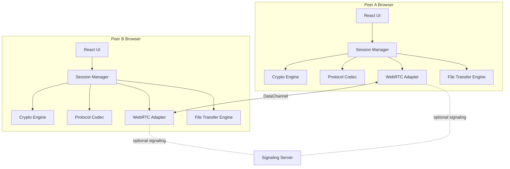

### Component Diagram

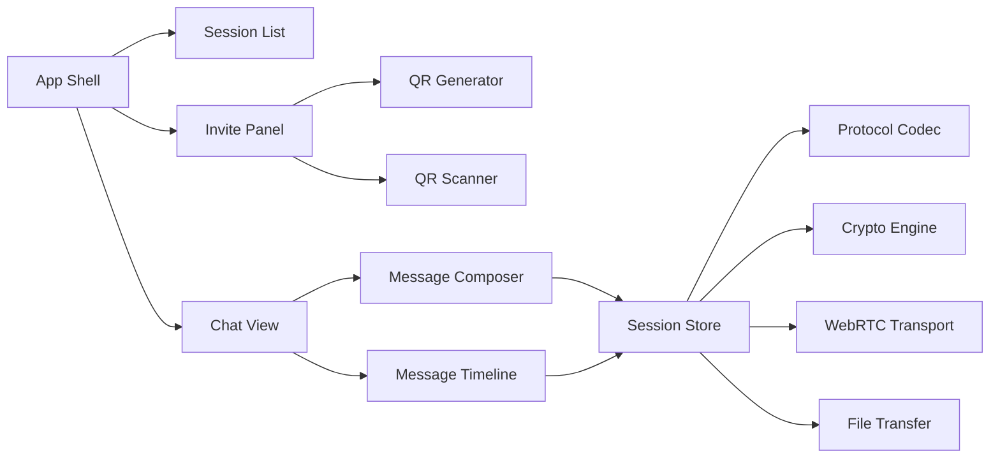

### Data Flow

Outbound text message:

1. User submits text.
2. UI validates non-empty text and size.
3. Session manager creates canonical `TEXT` payload.
4. Protocol codec serializes the packet body.
5. Crypto engine encrypts and authenticates the packet.
6. Transport sends ciphertext over DataChannel.
7. Local transcript appends pending message.
8. Remote peer decrypts, validates, acknowledges, and renders.

Inbound packet:

1. DataChannel receives binary frame.
2. Transport enforces frame size.
3. Protocol codec parses encrypted envelope.
4. Crypto engine verifies authentication tag and decrypts.
5. Replay window validates sequence number and packet ID.
6. Message handler dispatches by packet type.
7. Session state updates.
8. UI re-renders relevant session.

### Runtime Architecture

Runtime state is held in a React-accessible store. The store may be implemented with React context plus reducer, Zustand, Jotai, or another small state library. Persistent state APIs are prohibited for session data.

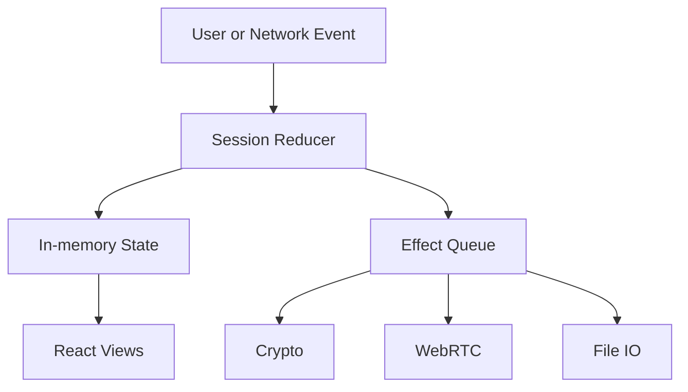

### Module Boundaries

| Module | Responsibility | Must not do |
|---|---|---|
| `ui` | Render and collect user input | Direct crypto, direct packet parsing |
| `session` | State machine and orchestration | Browser storage writes |
| `crypto` | Key generation, derive, encrypt, decrypt | UI rendering |
| `protocol` | Packet schemas, encoding, validation | Network operations |
| `transport` | WebRTC setup and DataChannel IO | Application packet semantics |
| `qr` | Invite encode/decode, QR scan/generate | Session mutation |
| `files` | Chunking, hashing, transfer state | UI styling |
| `config` | Limits and feature flags | Runtime secrets |

### Package Layout

```text
src/
  app/
    App.tsx
    providers.tsx
  components/
    chat/
    sessions/
    qr/
    files/
    common/
  hooks/
    useSession.ts
    useQrScanner.ts
    useFileTransfer.ts
  lib/
    crypto/
      keys.ts
      aead.ts
      hkdf.ts
      random.ts
    protocol/
      packets.ts
      schemas.ts
      codec.ts
      limits.ts
    transport/
      webrtc.ts
      signaling.ts
      manual.ts
    qr/
      invite.ts
      checksum.ts
    files/
      chunker.ts
      transfer.ts
      hash.ts
  state/
    sessionStore.ts
    reducers.ts
    actions.ts
  tests/
```

---

## Chapter 5 - Technology Decisions

### Why React

React provides a mature component model, strong ecosystem support, and predictable UI composition. The application has several independent interface regions: session list, invitation panel, chat transcript, composer, file transfer list, and modal dialogs. React is appropriate because these regions are driven by changing in-memory state.

Alternatives rejected:

| Alternative | Reason rejected |
|---|---|
| Plain DOM | More boilerplate and weaker structure for complex state. |
| Vue | Viable, but React has broader hiring and ecosystem alignment for this project. |
| Svelte | Viable, but smaller ecosystem for some QR/WebRTC examples. |

### Why TypeScript

The protocol has many packet variants and strict validation requirements. TypeScript reduces accidental misuse through discriminated unions, branded IDs, and typed module boundaries. It also improves long-term maintainability for open source contributors.

### Why TailwindCSS

TailwindCSS supports fast, consistent styling without inventing a large custom CSS architecture. It is suitable for a compact application UI. The project should still centralize design tokens for color, spacing, and focus states.

### Why WebRTC

WebRTC is the only broadly available browser technology that supports direct peer-to-peer communication. It provides NAT traversal, optional relays, and DataChannels for arbitrary data.

### Why DataChannels

RTCDataChannel gives message-oriented bidirectional transport with congestion control and support for binary frames. It avoids encoding application packets as text over media channels or requiring a persistent WebSocket backend for message relay.

### Why Web Crypto

Web Crypto API is native, audited by browser vendors, and avoids shipping a large cryptographic implementation in JavaScript. The app still defines an application-layer encrypted protocol because WebRTC transport security alone does not bind the QR invitation to application identity or protect against an untrusted signaling server at the application layer.

### Why No Backend

The product goal is temporary direct communication without permanent infrastructure. A backend would introduce data retention, operational, legal, and trust concerns. Optional signaling is allowed only for connection setup and must not receive plaintext message content.

### Tradeoffs

| Decision | Benefit | Cost |
|---|---|---|
| No accounts | Minimal friction and no identity database | No durable identity or contacts |
| No persistence | Strong data minimization | Reload loses all sessions |
| WebRTC | Direct transport | NAT traversal complexity |
| Application encryption | Defense in depth | More protocol complexity |
| QR pairing | Human-friendly invite | Physical/screen proximity or separate channel needed |
| Static hosting | Simple deployment | Dynamic features require optional services |

---

## Chapter 6 - Session Lifecycle

### States

Primary session states:

- `idle`
- `creating`
- `inviting`
- `joining`
- `connecting`
- `authenticating`
- `active`
- `expiring`
- `expired`
- `destroying`
- `destroyed`
- `error`

### Creation

Session creation performs:

1. Validate browser capability.
2. Generate session ID.
3. Generate ephemeral ECDH key pair.
4. Compute public key fingerprint.
5. Create invitation object.
6. Encode invitation to QR/manual payload.
7. Create RTCPeerConnection.
8. Prepare DataChannel.
9. Enter `inviting`.

### Invitation

The invitation includes enough information for the joining peer to validate version, identify the session, obtain the host public key, and select signaling mode. It must not include private keys or message keys.

### Connection

Connection may use:

- Optional signaling server.
- Manual SDP/ICE copy-paste.
- LAN discovery in future versions.

### Authentication

After WebRTC DataChannel opens, peers run an application-level handshake:

1. Joiner sends `JOIN` with its ephemeral public key and nonce.
2. Host validates session ID and expiry.
3. Both derive shared secret with ECDH.
4. Both derive directional AEAD keys using HKDF.
5. Host sends authenticated `WELCOME`.
6. Both verify transcript hash.
7. Session enters `active`.

### Messaging

All application packets after handshake use authenticated encryption. Each encrypted packet includes sequence number, packet ID, type, and associated data.

### Termination

Termination occurs when:

- User destroys session.
- Remote peer sends `DESTROY_SESSION`.
- Connection closes permanently.
- Session expires.
- Fatal protocol error occurs.

### Timeout

Timeouts:

| Timeout | Default |
|---|---:|
| Invitation expiry | 10 minutes |
| Connection attempt | 45 seconds |
| Authentication | 15 seconds |
| Ping interval | 10 seconds |
| Ping missing threshold | 3 intervals |
| Destroy cleanup grace | 2 seconds |

### Cleanup

Cleanup must:

- Close DataChannels.
- Close RTCPeerConnection.
- Stop camera streams.
- Abort file transfers.
- Clear queues and buffers.
- Revoke Blob URLs.
- Drop CryptoKey references.
- Clear timers.
- Remove session from UI store.

### Creation Sequence

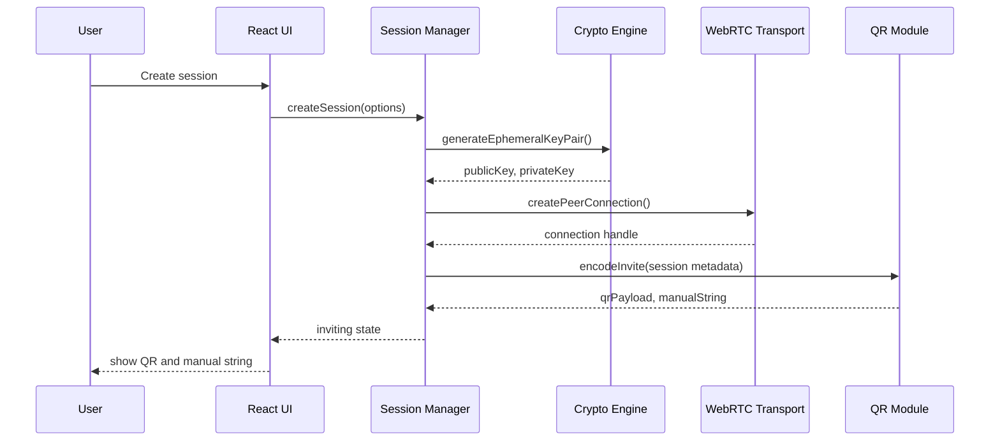

---

## Chapter 7 - QR Protocol

### Design Goals

- Compact enough for reliable QR scanning.
- Versioned for future compatibility.
- Human-copyable through a manual string.
- Resistant to accidental corruption through checksum.
- Contains no private key material.
- Allows optional signaling configuration.

### Payload Summary

Canonical JSON is encoded as UTF-8, compressed only if needed in a future version, and base64url encoded with a prefix.

Manual string format:

```text
ep2p1.<base64url(canonical-json)>.<checksum>
```

QR payload uses the same string.

### Fields

| Field | Type | Required | Description |
|---|---|---:|---|
| `pid` | string | yes | Protocol ID, fixed `ep2p-chat`. |
| `v` | integer | yes | QR protocol version. |
| `sid` | string | yes | Base64url 128-bit session ID. |
| `createdAt` | integer | yes | Unix milliseconds. |
| `expiresAt` | integer | yes | Unix milliseconds. |
| `role` | string | yes | Creator role, normally `host`. |
| `pub` | string | yes | Base64url exported ECDH public key. |
| `fp` | string | yes | Short public key fingerprint. |
| `sigMode` | string | yes | `manual`, `optional-server`, or `none`. |
| `sig` | object | no | Optional signaling server metadata. |
| `features` | string[] | yes | Feature flags. |

### Example JSON

```json
{
  "pid": "ep2p-chat",
  "v": 1,
  "sid": "Bq7u2h9Kqcb6Snf1ydP5WQ",
  "createdAt": 1782631200000,
  "expiresAt": 1782631800000,
  "role": "host",
  "pub": "BDxT7oGxJ6_hA0fYqL6nJ1N7yL8nZx6CMvWn3pG9sS2YIuYdYwA4nYDf-example",
  "fp": "9K4M-72QD",
  "sigMode": "optional-server",
  "sig": {
    "url": "wss://signal.example.org/v1",
    "room": "Bq7u2h9Kqcb6Snf1ydP5WQ"
  },
  "features": ["text", "files", "typing", "destroy"]
}
```

### Canonicalization

Canonical JSON rules:

1. UTF-8 encoding.
2. Lexicographic key order.
3. No insignificant whitespace.
4. Integers encoded in base 10.
5. Strings encoded as JSON strings with standard escaping.
6. Unknown fields allowed only under `ext`.

### Checksum

Checksum:

```text
checksum = base32(truncate_40bits(SHA-256("ep2p-invite-v1" || canonicalJsonBytes)))
```

The checksum detects accidental corruption and casual transcription errors. It is not an authentication mechanism.

### Maximum Payload

Target maximum QR string length: 1400 bytes. If optional signaling metadata would exceed the target, the app must fall back to manual signaling details outside the QR payload.

### Binary Layout

Version 1 uses canonical JSON for simplicity. A future binary layout may use CBOR. Reserved binary layout:

| Offset | Size | Field |
|---:|---:|---|
| 0 | 4 | Magic `EP2P` |
| 4 | 1 | Version |
| 5 | 1 | Flags |
| 6 | 8 | Created timestamp seconds |
| 14 | 8 | Expiry timestamp seconds |
| 22 | 16 | Session ID |
| 38 | 2 | Public key length |
| 40 | N | Public key bytes |
| 40+N | 5 | Checksum |

### Error Handling

| Error | Behavior |
|---|---|
| Unknown prefix | Reject and show invalid invitation. |
| Unsupported version | Show version mismatch with upgrade suggestion. |
| Bad base64url | Reject. |
| Bad checksum | Reject. |
| Expired payload | Reject before connection setup. |
| Clock skew | Show warning if created time is in the future by more than 2 minutes. |
| Oversized payload | Reject before parsing JSON deeply. |

### Backward Compatibility

Clients must reject major versions they do not understand. Minor feature additions should appear in `features` or `ext`. Unknown feature flags must not break base text chat.

---

## Chapter 8 - Networking

### WebRTC Flow

1. Host creates `RTCPeerConnection`.
2. Host creates ordered reliable DataChannel named `ep2p-control`.
3. Host creates offer.
4. Offer reaches joiner through signaling mode.
5. Joiner creates answer.
6. ICE candidates are exchanged.
7. DataChannel opens.
8. Application authentication begins.

### ICE

ICE candidates should be gathered with default STUN servers in development. Production deployments should allow configuration. The app must display connection state without exposing raw candidate details unless debug mode is enabled.

### STUN

STUN helps peers discover public reflexive addresses. It does not relay traffic and does not hide IP addresses. The default configuration may include privacy-respecting public STUN servers, but self-hosted deployments should be able to configure their own.

### TURN

TURN is optional and relays encrypted WebRTC traffic when direct connection fails. TURN improves reliability but introduces infrastructure cost and exposes metadata to the relay. Application-layer encryption still protects message content.

### Optional Signaling

The signaling server only exchanges setup messages:

- Offer.
- Answer.
- ICE candidates.
- Session room lifecycle.

It must not receive decrypted chat packets. It should avoid request logging where possible and must not require accounts.

Signaling message example:

```json
{
  "type": "offer",
  "room": "Bq7u2h9Kqcb6Snf1ydP5WQ",
  "from": "host",
  "payload": {
    "sdp": "v=0..."
  }
}
```

### Offline Mode

Offline mode supports manual signaling only if both peers can exchange SDP and ICE data through another channel. Fully offline direct discovery is not part of MVP.

### LAN Mode

Future LAN mode may use local network discovery. Browser restrictions make this difficult without additional APIs or native wrappers. LAN mode must still use the same application-level cryptographic handshake.

### Self-host Mode

Self-hosted deployments can provide:

- Static frontend hosting.
- Optional WebSocket signaling.
- Optional STUN/TURN configuration.

The frontend should read runtime config from a static JSON file or build-time environment variables.

### Manual Signaling

Manual signaling provides maximum infrastructure independence:

1. Host copies offer.
2. Joiner pastes offer and generates answer.
3. Joiner copies answer.
4. Host pastes answer.
5. ICE candidates may be bundled or exchanged incrementally as text blobs.

Manual payloads should be compressed and base64url encoded if large.

### Connection Retries

Retry policy:

| Event | Behavior |
|---|---|
| ICE failed | Restart ICE once automatically. |
| Signaling timeout | Offer manual signaling fallback. |
| DataChannel closed before auth | Return to connecting if within timeout. |
| Active connection lost | Attempt reconnection only if session not destroyed or expired. |

### Timeouts

The connection attempt timer begins when the joiner accepts an invitation. If no DataChannel opens in 45 seconds, the app shows failure with options to retry or switch signaling mode.

### Connection Recovery

Recovery must not reuse message nonces incorrectly. If a DataChannel is recreated, peers must either:

- Continue the same session with fresh directional key epoch, or
- Destroy and create a new session.

MVP should prefer destroy-and-recreate for simplicity after unrecoverable connection loss.

---

## Chapter 9 - Cryptography

### Goals

- Confidentiality of message content.
- Integrity and authenticity of application packets within a paired session.
- Forward secrecy for sessions.
- Replay protection.
- No persistent key material.

### Algorithms

| Purpose | Algorithm | Reason |
|---|---|---|
| ECDH | P-256 via Web Crypto | Broad browser support and native implementation. |
| KDF | HKDF-SHA-256 | Standard key derivation with context separation. |
| AEAD | AES-GCM-256 | Native Web Crypto support and authenticated encryption. |
| Hash | SHA-256 | Broad support. |
| Randomness | `crypto.getRandomValues` | Browser CSPRNG. |

Alternative algorithms such as X25519 and ChaCha20-Poly1305 are attractive but not uniformly available through Web Crypto in all target browsers. If support improves, a future version may negotiate them.

### Key Exchange

Each session creates an ephemeral ECDH key pair. The host public key is included in the invitation. The joiner generates its own ephemeral key and sends it during authentication.

Shared secret:

```text
sharedSecret = ECDH(localPrivateKey, remotePublicKey)
```

Transcript hash:

```text
transcript = SHA-256(
  "ep2p-handshake-v1" ||
  sessionId ||
  hostPublicKey ||
  joinerPublicKey ||
  hostNonce ||
  joinerNonce
)
```

### Session Keys

HKDF derives separate directional keys:

```text
root = HKDF-Extract(salt = sessionId || transcript, IKM = sharedSecret)
sendKeyHost = HKDF-Expand(root, "ep2p host->joiner aead v1", 32)
sendKeyJoiner = HKDF-Expand(root, "ep2p joiner->host aead v1", 32)
```

Each peer uses the appropriate key based on direction. Directional separation prevents nonce collision across peers.

### Encryption

AES-GCM inputs:

- Key: directional AES key.
- Nonce: 96-bit deterministic nonce built from key epoch and sequence number.
- Plaintext: canonical packet body.
- Additional authenticated data: session ID, protocol version, packet type, sequence number, key epoch.

Nonce format:

| Bytes | Field |
|---:|---|
| 0-3 | Key epoch unsigned integer |
| 4-11 | Sequence number unsigned integer |

The sequence number is monotonically increasing per direction and per key epoch.

### Authentication and Integrity

AES-GCM authentication tags provide packet integrity. A packet is accepted only if:

- AEAD authentication succeeds.
- Session ID matches.
- Version is supported.
- Packet type is valid for current state.
- Sequence number is inside replay window and not previously seen.
- Payload schema validation succeeds.

### Forward Secrecy

Because ECDH private keys are ephemeral and never persisted, compromise after session cleanup should not reveal past session keys unless browser memory was captured during the session.

### Nonce Generation

Do not generate random AES-GCM nonces for normal messages. Use deterministic nonces from sequence numbers to avoid accidental random nonce reuse. Sequence number overflow is fatal and requires key rotation or session termination.

### Random Number Generation

All random values use `crypto.getRandomValues`. Required random values:

- Session ID: 128 bits minimum.
- Handshake nonces: 128 bits each.
- File transfer IDs: 128 bits.

### Key Rotation

MVP may rotate keys after a fixed number of packets:

```text
rotate after min(2^32 packets, 1 hour, 1 GiB encrypted)
```

Rotation procedure:

1. Initiator sends `KEY_ROTATE_PROPOSE`.
2. Both peers derive epoch `n+1` keys with HKDF from root and transcript plus epoch.
3. Peers acknowledge.
4. After ack, new outbound packets use epoch `n+1`.
5. Old epoch accepted only for a short drain window.

If key rotation is not implemented in MVP, enforce lower packet and byte limits.

### Secure Deletion

JavaScript cannot guarantee secure memory deletion. The app must reduce exposure:

- Drop references to keys and buffers.
- Overwrite mutable ArrayBuffers where possible before release.
- Revoke object URLs.
- Avoid copying plaintext unnecessarily.
- Do not log secrets.

---

## Chapter 10 - Message Protocol

### Packet Envelope

All encrypted packets are carried inside an outer envelope:

```json
{
  "pid": "ep2p-chat",
  "v": 1,
  "sid": "Bq7u2h9Kqcb6Snf1ydP5WQ",
  "epoch": 0,
  "seq": 42,
  "type": "TEXT",
  "ciphertext": "base64url...",
  "tag": "base64url..."
}
```

For compact binary transport, the envelope should be encoded as binary. JSON is acceptable for MVP if size limits are enforced.

### Common Plaintext Fields

| Field | Type | Description |
|---|---|---|
| `id` | string | Unique packet ID, base64url 128-bit. |
| `type` | string | Packet type. |
| `v` | integer | Packet schema version. |
| `ts` | integer | Unix milliseconds. |
| `payload` | object | Type-specific payload. |

### Packet Types

| Type | Direction | State | Max plaintext |
|---|---|---|---:|
| `JOIN` | joiner -> host | authenticating | 8 KiB |
| `WELCOME` | host -> joiner | authenticating | 8 KiB |
| `TEXT` | both | active | 16 KiB |
| `IMAGE` | both | active | 4 KiB metadata |
| `FILE` | both | active | 4 KiB metadata |
| `FILE_CHUNK` | both | active | 72 KiB |
| `PING` | both | active | 512 bytes |
| `PONG` | both | active | 512 bytes |
| `TYPING` | both | active | 512 bytes |
| `ACK` | both | active | 2 KiB |
| `LEAVE` | both | active | 1 KiB |
| `DESTROY_SESSION` | both | any after auth | 1 KiB |

### TEXT

```json
{
  "id": "bOnWmE0uY3diWQJ_C9Ir_A",
  "type": "TEXT",
  "v": 1,
  "ts": 1782631275000,
  "payload": {
    "body": "Hello",
    "encoding": "utf-8"
  }
}
```

Validation:

- `body` must be non-empty after preserving intentional whitespace rules.
- UTF-8 byte length must be <= 16 KiB.
- Text must be rendered as text, never as HTML.

### IMAGE

`IMAGE` announces an image transfer. Chunks use `FILE_CHUNK`.

```json
{
  "id": "qK3F7j2vY0Tj48vfqW7xXg",
  "type": "IMAGE",
  "v": 1,
  "ts": 1782631280000,
  "payload": {
    "transferId": "01WmZW4QaO9HB7P0azusGA",
    "name": "photo.jpg",
    "mime": "image/jpeg",
    "size": 2450012,
    "sha256": "base64url...",
    "chunkSize": 65536,
    "chunkCount": 38,
    "width": 1600,
    "height": 1200
  }
}
```

### FILE

```json
{
  "id": "svypRr1rTWcO2_PAVOxS_A",
  "type": "FILE",
  "v": 1,
  "ts": 1782631300000,
  "payload": {
    "transferId": "KEL7QbrJWJt1Ki2HeZjxIQ",
    "name": "report.pdf",
    "mime": "application/pdf",
    "size": 842110,
    "sha256": "base64url...",
    "chunkSize": 65536,
    "chunkCount": 13
  }
}
```

### FILE_CHUNK

```json
{
  "id": "g4uJ7InI-UxjeqVzy3Ki5w",
  "type": "FILE_CHUNK",
  "v": 1,
  "ts": 1782631300100,
  "payload": {
    "transferId": "KEL7QbrJWJt1Ki2HeZjxIQ",
    "index": 0,
    "bytes": "base64url..."
  }
}
```

Validation:

- `index` must be within range.
- Chunk size must match expected size except final chunk.
- Duplicate chunks are ignored after hash confirmation.

### PING and PONG

```json
{
  "id": "d9IqDJuxmhrqVs-60Kz8RQ",
  "type": "PING",
  "v": 1,
  "ts": 1782631310000,
  "payload": {
    "nonce": "FfUFcTCEIzo",
    "sentAt": 1782631310000
  }
}
```

`PONG` echoes the nonce and `sentAt`.

### JOIN

`JOIN` may be sent before application AEAD keys are available, but it must be protected by the WebRTC DTLS channel and validated against the invitation. If encrypting the initial join is not possible yet, keep it minimal and non-secret.

```json
{
  "id": "w6oMydz_m8HsoK4N2XgUKQ",
  "type": "JOIN",
  "v": 1,
  "ts": 1782631265000,
  "payload": {
    "sid": "Bq7u2h9Kqcb6Snf1ydP5WQ",
    "joinerPub": "base64url-spki",
    "joinerNonce": "base64url-128bit",
    "features": ["text", "files", "typing"]
  }
}
```

### LEAVE

```json
{
  "id": "Ym6WquGf0nvI8uewDz_f_g",
  "type": "LEAVE",
  "v": 1,
  "ts": 1782631400000,
  "payload": {
    "reason": "user_closed"
  }
}
```

### TYPING

```json
{
  "id": "H0foV1zVgKmQ__5O6B-rnA",
  "type": "TYPING",
  "v": 1,
  "ts": 1782631320000,
  "payload": {
    "active": true,
    "ttlMs": 3000
  }
}
```

### ACK

```json
{
  "id": "4XAx4t01tALX3-FaMEKjSA",
  "type": "ACK",
  "v": 1,
  "ts": 1782631325000,
  "payload": {
    "packetId": "bOnWmE0uY3diWQJ_C9Ir_A",
    "status": "received"
  }
}
```

### DESTROY_SESSION

```json
{
  "id": "oL5LxTV_tqKniA_b4mxILw",
  "type": "DESTROY_SESSION",
  "v": 1,
  "ts": 1782631500000,
  "payload": {
    "reason": "user_requested",
    "deleteImmediately": true
  }
}
```

### Binary Layout

Recommended encrypted binary envelope:

| Offset | Size | Field |
|---:|---:|---|
| 0 | 4 | Magic `EPC1` |
| 4 | 1 | Protocol version |
| 5 | 1 | Packet type code |
| 6 | 2 | Flags |
| 8 | 16 | Session ID |
| 24 | 4 | Epoch |
| 28 | 8 | Sequence number |
| 36 | 2 | AAD length |
| 38 | 4 | Ciphertext length |
| 42 | N | AAD bytes |
| 42+N | M | Ciphertext including GCM tag |

### Pseudocode

```ts
async function sendPacket(session: Session, type: PacketType, payload: unknown) {
  const packet = buildPlaintextPacket(type, payload);
  validatePlaintextPacket(packet);

  const seq = session.nextOutboundSeq++;
  const aad = encodeAad({
    protocolVersion: 1,
    sessionId: session.id,
    epoch: session.keyEpoch,
    seq,
    type
  });

  const nonce = buildNonce(session.keyEpoch, seq);
  const ciphertext = await encryptAesGcm(session.sendKey, nonce, packet, aad);
  session.dataChannel.send(encodeEnvelope(aad, ciphertext));
}
```

---

## Chapter 11 - File Transfer

### Overview

File transfer is an application-level protocol over the encrypted DataChannel. It uses metadata packets, fixed-size chunks, acknowledgements, retries, cancellation, and final hash verification.

### Chunking

Default chunk size: 64 KiB. The sender reads the file in slices:

```ts
for (let offset = 0; offset < file.size; offset += chunkSize) {
  const chunk = file.slice(offset, offset + chunkSize);
  await sendChunk(transferId, index, chunk);
}
```

### Compression

MVP should not compress arbitrary files by default. Compression can leak information through size side channels and may waste CPU for already-compressed formats. Future versions can support opt-in compression for text-like MIME types.

### Integrity

The sender computes SHA-256 of the full file before transfer or incrementally while sending. The receiver computes SHA-256 after reconstruction and compares against metadata.

### Progress

Progress state:

| Field | Meaning |
|---|---|
| `bytesSent` | Bytes transmitted by sender. |
| `bytesReceived` | Bytes accepted by receiver. |
| `chunkCount` | Total chunks. |
| `ackedChunks` | Chunks acknowledged. |
| `state` | `pending`, `active`, `paused`, `complete`, `failed`, `cancelled`. |

### Retries

Reliable ordered DataChannels already retransmit. Application-level retries are still useful after resumable transfer support. MVP should detect stalled transfers and fail clearly rather than implementing complex resume semantics.

### Cancellation

Cancellation packet:

```json
{
  "type": "FILE_CANCEL",
  "v": 1,
  "payload": {
    "transferId": "KEL7QbrJWJt1Ki2HeZjxIQ",
    "reason": "user_cancelled"
  }
}
```

### Large Files

Large files must respect memory limits:

- Do not convert whole files to base64 in memory for transport if binary frames are available.
- Use `Blob.slice`.
- Limit concurrent chunks.
- Apply DataChannel backpressure using `bufferedAmount`.
- Pause sends when `bufferedAmount` exceeds threshold.

### Images

Images should be treated as file transfers plus UI preview. Avoid reading EXIF metadata unless necessary. Consider stripping metadata in a future version, but do not mutate user files silently in MVP.

### Memory Limits

Recommended defaults:

| Limit | Value |
|---|---:|
| Max generic file | 100 MiB |
| Max image | 20 MiB |
| Max active incoming file buffers | 2 |
| DataChannel buffered high watermark | 4 MiB |
| DataChannel buffered low watermark | 1 MiB |

---

## Chapter 12 - Memory Management

### RAM-only Storage

The application must not store session state persistently. Prohibited for session data:

- `localStorage`
- `sessionStorage`
- IndexedDB
- Cache API
- Cookies
- Service worker caches
- URL query parameters containing secrets

Allowed:

- In-memory JavaScript objects.
- `Blob` and `File` references selected by the user.
- Object URLs during active session lifetime.

### Garbage Collection

Garbage collection is nondeterministic. The app must still release references promptly:

- Remove messages from state on session destruction.
- Clear arrays and maps.
- Abort streams.
- Close channels.
- Null references in long-lived managers.

### Blob URLs

Every `URL.createObjectURL` call must be paired with `URL.revokeObjectURL`.

```ts
const url = URL.createObjectURL(blob);
session.objectUrls.add(url);

function cleanupSession(session: Session) {
  for (const url of session.objectUrls) URL.revokeObjectURL(url);
  session.objectUrls.clear();
}
```

### Object Cleanup

Cleanup checklist:

- Timers and intervals.
- Event listeners.
- Media streams and camera tracks.
- RTCPeerConnection.
- RTCDataChannel.
- File transfer buffers.
- Pending promises with abort controllers.
- Object URLs.

### Session Cleanup

Session cleanup is idempotent:

```ts
function destroySession(id: SessionId) {
  const session = sessions.get(id);
  if (!session || session.state === "destroyed") return;
  session.state = "destroying";
  cleanupTransport(session);
  cleanupFiles(session);
  cleanupCrypto(session);
  cleanupTimers(session);
  sessions.delete(id);
}
```

### Browser Constraints

Browsers may keep memory alive after references are removed. Users requiring high assurance should close the tab or browser after sensitive sessions. The UI should make this limitation available in privacy documentation.

---

## Chapter 13 - Threat Model

### Assets

| Asset | Description |
|---|---|
| Message plaintext | Text, images, files, typing activity. |
| Session keys | AEAD keys and ECDH private keys. |
| Invitation payload | Session ID, host public key, expiry. |
| Metadata | IP addresses, timing, file sizes, message sizes. |
| UI state | In-memory transcript and transfer progress. |

### Attackers

| Attacker | Capability |
|---|---|
| Passive network observer | Observes network traffic and timing. |
| Active network attacker | Modifies or injects signaling traffic. |
| Malicious signaling server | Reads and alters offers, answers, ICE messages. |
| Malicious peer | Sends malformed packets, huge files, abusive content. |
| Local attacker | Accesses device, browser, clipboard, screenshots. |
| Supply chain attacker | Compromises dependency or build process. |

### Attack Surfaces

- QR parser.
- Manual string parser.
- Signaling channel.
- WebRTC negotiation.
- DataChannel packet parser.
- File transfer engine.
- Image preview rendering.
- Clipboard interactions.
- Dependency tree.
- Static hosting configuration.

### Threats

| Threat | Impact | Likelihood | Risk |
|---|---|---|---|
| MITM during signaling | Message interception or peer impersonation | Medium | High |
| QR spoofing | Join wrong session | Medium | Medium |
| Replay packet | Duplicate actions | Medium | Medium |
| Malformed packet crash | DoS | High | Medium |
| Oversized file memory exhaustion | Browser crash | Medium | High |
| XSS through message rendering | Secret disclosure | Low if escaped | High |
| Supply chain compromise | Full compromise | Low | High |
| IP exposure | Metadata leakage | High | Medium |

### Trust Assumptions

- Browser cryptographic primitives are correct.
- User device and browser are not compromised.
- Peers intentionally share invitation through an acceptable channel.
- Static app bundle has not been tampered with.
- Optional signaling server is not trusted with message content.

### Security Boundaries

Primary security boundary is the application cryptographic session. The UI, protocol parser, and transport all run in the same browser origin and are not separate privilege domains.

---

## Chapter 14 - Security Analysis

### MITM

An attacker controlling signaling could replace SDP and ICE data. Application-level ECDH keys are bound to the invitation through the host public key. The joiner must use the host public key from the QR/manual invite. The host validates the joiner's public key during handshake and both derive keys from the transcript.

Mitigations:

- Include host public key fingerprint in the invitation.
- Derive keys from both public keys and nonces.
- Verify transcript hash in authenticated `WELCOME`.
- Show short authentication code for optional human comparison.

### Replay Attacks

Replay is mitigated through sequence numbers, replay windows, timestamps, and packet IDs.

Rules:

- Reject duplicate sequence numbers per direction and epoch.
- Reject packets outside acceptable state.
- Reject stale handshake attempts after expiry.

### QR Spoofing

An attacker may display a fake QR code. The app cannot prevent a user from scanning the wrong code. It can reduce risk:

- Show fingerprint on both devices.
- Use explicit session names chosen by user.
- Keep invitations short-lived.
- Avoid auto-joining without confirmation.

### DoS

Possible DoS vectors:

- Repeated connection attempts.
- Oversized packets.
- File transfer flooding.
- DataChannel buffered amount exhaustion.

Mitigations:

- Packet size limits.
- Rate limits.
- Backpressure.
- Maximum sessions.
- Transfer confirmation.
- Fatal close on repeated malformed packets.

### Malformed Packets

All packets must pass schema validation before dispatch. Unknown packet types are rejected or ignored based on negotiated feature flags. Parser errors must not crash the UI.

### Memory Exhaustion

Mitigations:

- Global memory budget.
- File size limits.
- Chunk window limits.
- Revoke object URLs.
- Clear inactive transcripts.

### XSS

Text messages must render as text nodes. Filenames must be escaped. The app must not use `dangerouslySetInnerHTML` for user content. Markdown rendering should be avoided in MVP.

### Injection

Manual invite strings and signaling messages are untrusted inputs. They must be parsed as data, never executed. URLs in config must be validated.

### Packet Flooding

Rate-limit high-frequency packet types:

| Packet | Limit |
|---|---:|
| `TYPING` | 1 per second per peer |
| `PING` | 1 per 5 seconds per peer |
| `TEXT` | 20 per 10 seconds |
| `FILE_CHUNK` | Controlled by backpressure |

### Malicious Peers

Once a user connects to a malicious peer, the peer can send abusive content, large files, or misleading filenames. Mitigations are local: confirmation prompts, limits, safe rendering, and easy session destruction.

### Browser Exploits

The project cannot fully mitigate browser engine vulnerabilities. It should reduce exposure by avoiding complex parsers, disabling remote HTML rendering, and keeping dependencies minimal.

### Supply Chain Attacks

Controls:

- Lockfile committed.
- Dependency review.
- Avoid unnecessary packages.
- Use `npm audit` or equivalent in CI.
- Reproducible static builds where practical.
- Pin GitHub Actions.

---

## Chapter 15 - Privacy Model

### What Is Private

Protected from network observers and optional signaling services:

- Message plaintext.
- File contents.
- Image contents.
- Typing packet content.
- Destroy reason, after authentication.

### What Is Not Private

Potentially visible:

- IP addresses to peers and STUN/TURN infrastructure.
- Timing of connections and messages.
- Approximate data volume.
- Browser user agent to static host and signaling server.
- File sizes and transfer timing to the connected peer.

### Metadata Leakage

WebRTC may reveal local and public network candidates depending on browser behavior and configuration. TURN can hide direct IP from the peer at the cost of trusting a relay with metadata.

### Browser Limitations

The browser may:

- Keep memory pages after cleanup.
- Cache static assets.
- Expose clipboard content through user actions.
- Allow extensions to inspect pages.
- Show content in OS-level app switchers or screenshots.

### Screenshots

The app cannot prevent screenshots or photos of the screen. Sensitive content should be treated as visible once displayed.

### Clipboard

Manual invitation copying uses the clipboard. Clipboard contents may be retained by the OS or clipboard managers. The invitation is not a message secret, but it can allow joining before expiry.

### OS Cache

Downloaded files or saved images leave the browser memory-only boundary. The app should distinguish between in-session preview and explicit user download.

### Limitations

The system provides content confidentiality within a session, not anonymity. It does not protect against compromised endpoints.

---

## Chapter 16 - Error Handling

### Error Categories

| Category | Examples |
|---|---|
| Capability | Missing WebRTC, missing Web Crypto, no camera. |
| Invitation | Bad checksum, expired, unsupported version. |
| Connection | ICE failure, signaling timeout, DataChannel close. |
| Authentication | Key mismatch, bad transcript, timeout. |
| Protocol | Malformed packet, bad schema, replay. |
| File | Too large, hash mismatch, cancelled. |
| Resource | Memory pressure, too many sessions. |

### Connection Failures

The UI should show:

- Current phase.
- Plain explanation.
- Retry option.
- Manual signaling fallback where applicable.
- Destroy session option.

### QR Errors

QR errors must not expose stack traces. Camera permission denial should provide manual string fallback.

### Packet Corruption

AEAD failure increments a protocol error counter. Repeated failures destroy the session because they may indicate attack or desynchronization.

### Version Mismatch

If major protocol versions differ, the app should reject connection and show both versions. Minor feature mismatch should degrade gracefully.

### Timeouts

Timeouts should be explicit and cancellable. Background tab behavior must be considered because timers can be delayed.

### File Failures

File hash mismatch invalidates the received file and releases buffers. The app may allow retry from the beginning.

### Recovery Strategies

| Failure | Recovery |
|---|---|
| QR scan denied | Manual string. |
| Signaling server down | Manual signaling. |
| ICE failure | ICE restart once, then manual/TURN suggestion. |
| Auth failure | Destroy and recreate. |
| File transfer failure | Retry transfer. |
| Memory pressure | Cancel transfer and cleanup. |

---

## Chapter 17 - APIs

### Core Types

```ts
export type SessionId = string & { readonly brand: unique symbol };
export type PacketId = string & { readonly brand: unique symbol };
export type TransferId = string & { readonly brand: unique symbol };

export type SessionState =
  | "idle"
  | "creating"
  | "inviting"
  | "joining"
  | "connecting"
  | "authenticating"
  | "active"
  | "expired"
  | "destroying"
  | "destroyed"
  | "error";

export interface Session {
  id: SessionId;
  state: SessionState;
  createdAt: number;
  expiresAt: number;
  role: "host" | "joiner";
  peer?: PeerState;
  transport?: TransportHandle;
  crypto?: CryptoSession;
  messages: ChatMessage[];
  transfers: Record<string, FileTransferState>;
}
```

### Hooks

```ts
export function useSessions(): {
  sessions: Session[];
  activeSessionId: SessionId | null;
  createSession(options?: CreateSessionOptions): Promise<SessionId>;
  joinSession(invite: string, options?: JoinSessionOptions): Promise<SessionId>;
  destroySession(id: SessionId): Promise<void>;
  setActiveSession(id: SessionId): void;
};

export function useChat(sessionId: SessionId): {
  messages: ChatMessage[];
  sendText(body: string): Promise<void>;
  sendTyping(active: boolean): void;
  sendFile(file: File): Promise<void>;
};

export function useQrScanner(): {
  state: "idle" | "requesting" | "scanning" | "error";
  start(): Promise<void>;
  stop(): void;
  lastResult: string | null;
  error: Error | null;
};
```

### Interfaces

```ts
export interface CryptoEngine {
  generateKeyPair(): Promise<EcdhKeyPair>;
  exportPublicKey(key: CryptoKey): Promise<string>;
  importPublicKey(encoded: string): Promise<CryptoKey>;
  deriveSession(input: DeriveSessionInput): Promise<CryptoSession>;
  encrypt(input: EncryptInput): Promise<ArrayBuffer>;
  decrypt(input: DecryptInput): Promise<ArrayBuffer>;
}

export interface Transport {
  createHostSession(config: RtcConfig): Promise<HostTransport>;
  joinSession(invite: InvitePayload, config: RtcConfig): Promise<JoinTransport>;
}

export interface ProtocolCodec {
  encodeInvite(payload: InvitePayload): string;
  decodeInvite(value: string): InvitePayload;
  encodePacket(packet: PlainPacket, crypto: CryptoSession): Promise<ArrayBuffer>;
  decodePacket(frame: ArrayBuffer, crypto: CryptoSession): Promise<PlainPacket>;
}
```

### Events

```ts
export type SessionEvent =
  | { type: "session.created"; sessionId: SessionId }
  | { type: "session.connected"; sessionId: SessionId }
  | { type: "session.expired"; sessionId: SessionId }
  | { type: "session.destroyed"; sessionId: SessionId }
  | { type: "message.received"; sessionId: SessionId; message: ChatMessage }
  | { type: "transfer.progress"; sessionId: SessionId; transfer: FileTransferState }
  | { type: "protocol.error"; sessionId: SessionId; error: ProtocolError };
```

### Utilities

```ts
export function base64UrlEncode(bytes: Uint8Array): string;
export function base64UrlDecode(value: string): Uint8Array;
export function canonicalJson(value: unknown): Uint8Array;
export function makeSessionId(): SessionId;
export function nowMs(): number;
export function assertNever(value: never): never;
```

---

## Chapter 18 - Frontend Architecture

### Folder Layout

The frontend should separate visual components from session orchestration. Shared UI primitives live under `components/common`, while domain features live under their own folders.

```text
components/
  common/
    IconButton.tsx
    Dialog.tsx
    Toast.tsx
  sessions/
    SessionList.tsx
    SessionTabs.tsx
    SessionStatus.tsx
  qr/
    InviteQr.tsx
    QrScanner.tsx
    ManualInvite.tsx
  chat/
    ChatView.tsx
    MessageTimeline.tsx
    MessageBubble.tsx
    MessageComposer.tsx
  files/
    FilePicker.tsx
    TransferProgress.tsx
```

### Components

| Component | Responsibility |
|---|---|
| `App` | Layout and providers. |
| `SessionList` | Show active sessions and unread counts. |
| `InviteQr` | Render QR payload. |
| `QrScanner` | Camera lifecycle and decoded result. |
| `ChatView` | Compose timeline, status, composer. |
| `MessageComposer` | Text input, send, attach file. |
| `TransferProgress` | Transfer state and cancel action. |

### Hooks

Hooks expose domain operations while hiding implementation:

- `useSessions`
- `useActiveSession`
- `useChat`
- `useConnectionStatus`
- `useQrScanner`
- `useFileTransfer`
- `useTheme`

### Context

Recommended providers:

- `SessionProvider`
- `ConfigProvider`
- `ThemeProvider`
- `ToastProvider`

### State

State should be normalized:

```ts
interface AppState {
  activeSessionId: SessionId | null;
  sessions: Record<SessionId, Session>;
  sessionOrder: SessionId[];
  toasts: Toast[];
  theme: "system" | "light" | "dark";
}
```

### Routing

MVP can be a single route. Avoid putting invitation secrets in URLs. If route state is needed, use non-secret UI state only.

### Dependency Graph

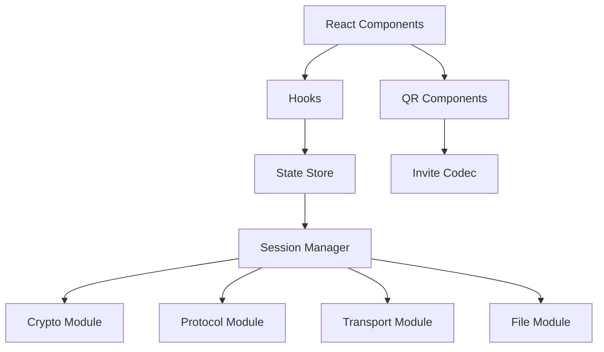

---

## Chapter 19 - State Machines

### Session State

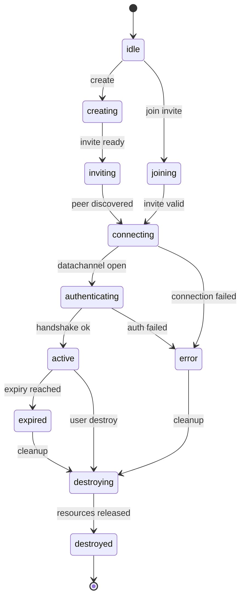

### Peer State

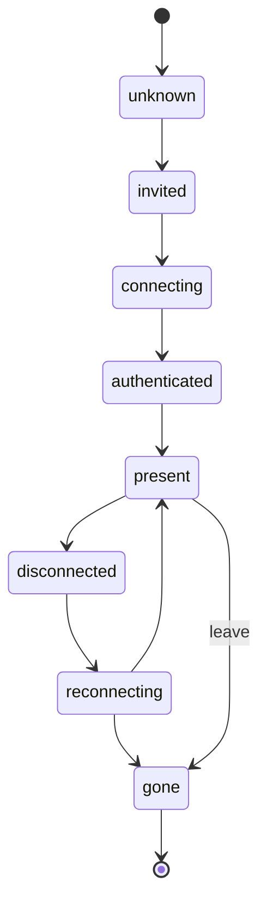

### Connection State

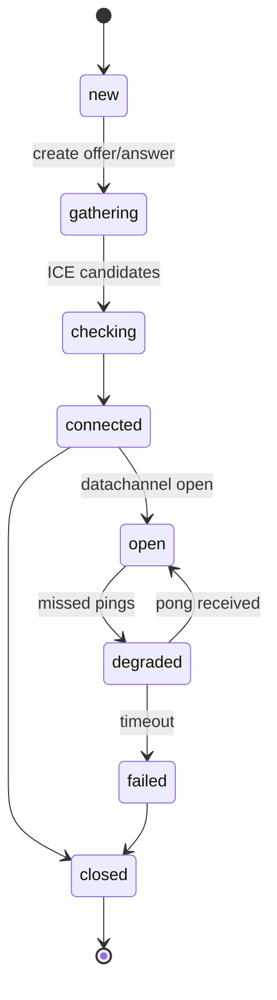

### Messaging State

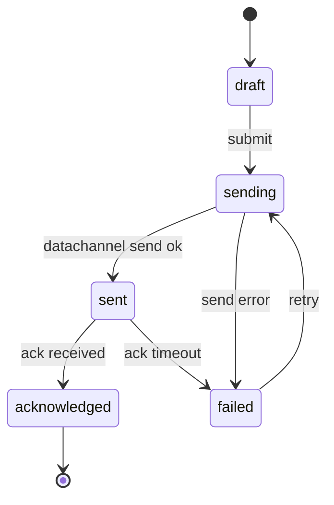

### File Transfer State

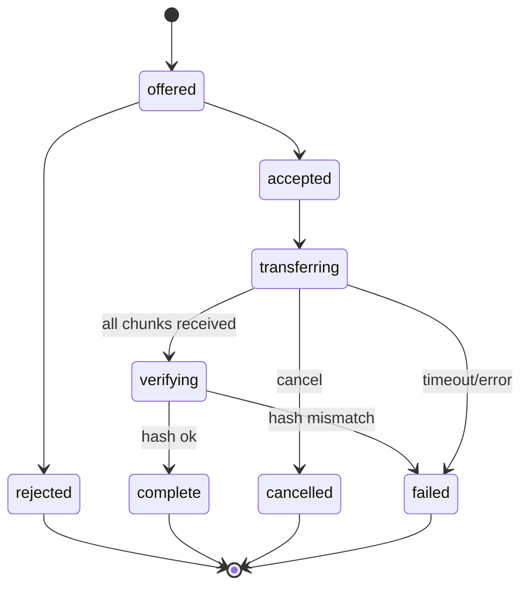

---

## Chapter 20 - Sequence Diagrams

### Session Creation

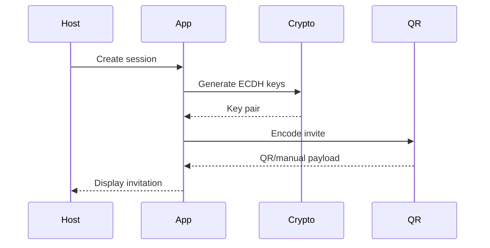

### QR Exchange

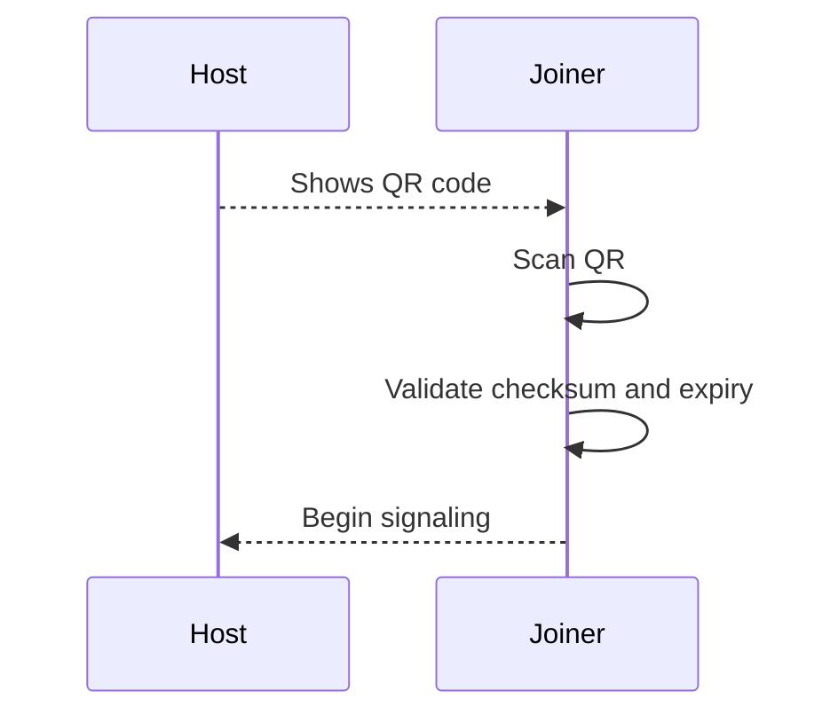

### Connection

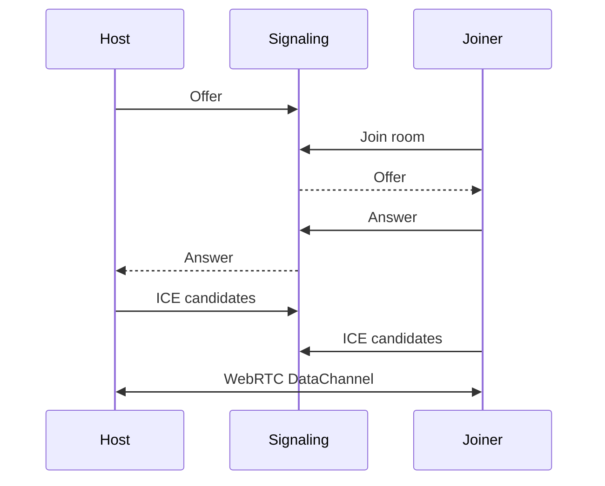

### Messaging

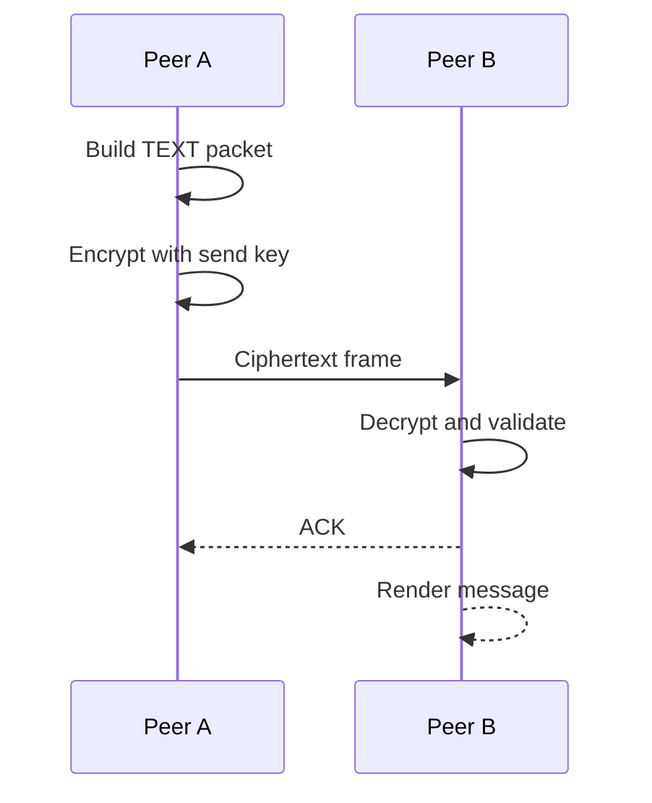

### Destroy Session

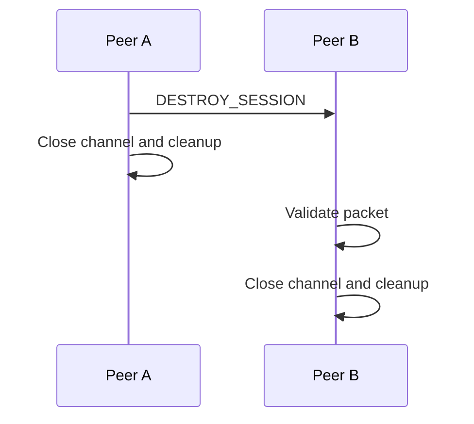

### File Transfer

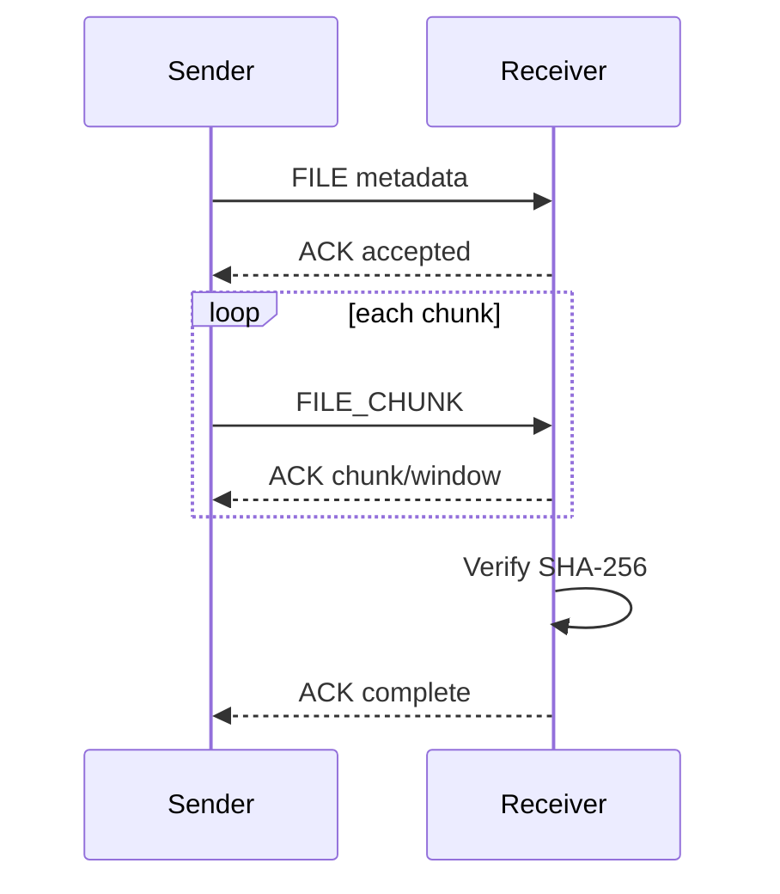

---

## Chapter 21 - Testing

### Unit Tests

Required coverage:

- Base64url encode/decode.
- Canonical JSON.
- QR checksum.
- Invite parsing.
- Packet schema validation.
- Nonce construction.
- Replay window.
- Reducers and state transitions.
- File chunk indexing.

### Integration Tests

Use browser automation to create two app instances and establish a session through mocked or local signaling.

Test cases:

- Host creates invite, joiner joins.
- Text message round trip.
- Typing indicator.
- File transfer under default limit.
- Destroy session from host.
- Destroy session from joiner.
- Signaling failure fallback.

### Security Tests

- Tampered invite checksum rejected.
- Expired invite rejected.
- AEAD tag failure rejected.
- Replayed packet rejected.
- Oversized packet rejected.
- Unknown packet type rejected.
- XSS payload rendered as inert text.
- Malicious filename escaped.

### Performance Tests

- Create session latency.
- QR encode/decode time.
- Encrypt/decrypt throughput.
- File transfer throughput.
- UI responsiveness during file transfer.

### Stress Tests

- Maximum simultaneous sessions.
- Rapid text sends.
- Repeated create/destroy loops.
- Large file rejection.
- DataChannel backpressure.
- Background tab and resume.

### Browser Compatibility

Manual and automated tests must run on target browsers. Safari and Mobile Safari need special attention because WebRTC and media permission behavior can differ.

### Manual QA Checklist

- Create session on desktop and join from mobile.
- Join using manual string.
- Deny camera and verify fallback.
- Send text with Unicode characters.
- Send image.
- Send file.
- Cancel file transfer.
- Destroy session.
- Reload page and verify no session remains.
- Verify dark mode.
- Verify keyboard navigation.

---

## Chapter 22 - Deployment

### Development

```bash
npm install
npm run dev
```

Development server should use HTTPS when testing WebRTC and camera behavior across devices. Localhost is usually treated as a secure context, but mobile device testing often needs HTTPS.

### Production

Build static assets:

```bash
npm run build
```

Deploy `dist/` to static hosting.

### Docker

Docker can serve static assets with Nginx:

```dockerfile
FROM node:22-alpine AS build
WORKDIR /app
COPY package*.json ./
RUN npm ci
COPY . .
RUN npm run build

FROM nginx:1.27-alpine
COPY --from=build /app/dist /usr/share/nginx/html
COPY nginx.conf /etc/nginx/conf.d/default.conf
```

### Static Hosting

Compatible providers:

- GitHub Pages.
- Netlify.
- Cloudflare Pages.
- Vercel static output.
- Self-hosted Nginx.

Production must configure:

- HTTPS.
- Strict CSP.
- `X-Content-Type-Options: nosniff`.
- `Referrer-Policy: no-referrer`.
- `Permissions-Policy` limiting camera/microphone where possible.

### GitHub Pages

GitHub Pages can host the static app. Avoid putting secrets in build-time environment variables because static assets are public.

### Self-hosted Signaling

Optional WebSocket signaling server:

Responsibilities:

- Create ephemeral rooms.
- Relay offer/answer/ICE.
- Expire rooms.
- Avoid message persistence.

Non-responsibilities:

- User accounts.
- Message relay after DataChannel established.
- Storing content.

### HTTPS and Certificates

Camera and Web Crypto features require secure contexts in normal production use. Use Let's Encrypt or provider-managed TLS.

---

## Chapter 23 - Development Roadmap

### MVP

- Static React app.
- Create and join session.
- QR generation.
- Manual invite.
- Manual signaling or simple local signaling.
- WebRTC DataChannel.
- Application ECDH handshake.
- Encrypted text messages.
- Destroy session.
- Memory-only state.

### Alpha

- QR scanning.
- Optional WebSocket signaling.
- Typing indicators.
- ACK packets.
- Basic file transfer.
- Browser compatibility suite.
- Security test suite.

### Beta

- Image previews.
- Transfer cancellation.
- Better error recovery.
- TURN configuration.
- Multiple simultaneous sessions.
- Accessibility audit.
- CSP hardened deployment.

### v1.0

- Stable protocol v1.
- Documented self-host deployment.
- Security policy.
- Reproducible release process.
- Public test vectors.
- Independent security review where possible.

### v1.1

- Key rotation.
- Transfer resume.
- Better mobile UI.
- Optional relay metadata controls.
- Improved manual signaling UX.

### Future Ideas

- Group chat.
- Mesh networking.
- Native mobile wrappers.
- WebTransport experiments.
- Noise Protocol.
- Post-quantum hybrid key exchange.

---

## Chapter 24 - Open Source

### Repository Structure

```text
ephemeral-p2p-chat/
  README.md
  LICENSE
  SECURITY.md
  CONTRIBUTING.md
  CODE_OF_CONDUCT.md
  docs/
    protocol.md
    threat-model.md
    deployment.md
  src/
  tests/
  scripts/
  .github/
    workflows/
    ISSUE_TEMPLATE/
    pull_request_template.md
```

### Contributing Guide

The contributing guide should explain:

- How to run the app.
- How to run tests.
- Coding conventions.
- Security-sensitive areas.
- How to propose protocol changes.
- How to avoid adding persistence or telemetry.

### Issue Templates

Templates:

- Bug report.
- Security bug notice pointing to `SECURITY.md`.
- Feature proposal.
- Protocol change proposal.
- Browser compatibility report.

### Pull Requests

PR requirements:

- Clear description.
- Tests for behavior changes.
- Security notes for protocol, crypto, parser, file, or networking changes.
- Screenshots for UI changes.
- No analytics or persistent storage additions without explicit design approval.

### License

Recommended license: Apache-2.0 or MIT. Apache-2.0 includes explicit patent language. MIT is shorter and widely understood. The project should choose one and apply it consistently.

### Security Policy

`SECURITY.md` should include:

- Supported versions.
- Private reporting process.
- Expected response timeline.
- Scope.
- Public disclosure process.

### Code Style

- TypeScript strict mode.
- ESLint and Prettier.
- No `any` in protocol and crypto modules without justification.
- Exhaustive switch statements for packet types.
- Tests required for parsers and cryptographic framing.

---

## Chapter 25 - Future Research

### Group Chat

Group chat requires either mesh DataChannels or a relay. Mesh becomes expensive as peer count grows. A secure group protocol would need sender keys, membership changes, and group transcript handling.

### Mesh Networking

Mesh networking could allow multiple peers to forward packets. This complicates trust, routing, metadata leakage, and abuse prevention.

### Offline-first

Offline-first conflicts with zero persistent storage. A separate mode could allow encrypted local persistence, but it would be a different privacy model and must be opt-in.

### Bluetooth

Web Bluetooth is not available uniformly and is not designed for arbitrary browser-to-browser networking. Native apps may be better for Bluetooth experiments.

### WebTransport

WebTransport can provide modern transport to servers, but it is not peer-to-peer. It may be useful for optional relays.

### LibP2P

LibP2P provides peer discovery and transport abstractions, but it may add complexity and dependencies. Browser support and bundle size need evaluation.

### Noise Protocol

Noise provides well-analyzed handshake patterns. A future protocol could use a Noise-inspired handshake if browser crypto support and implementation complexity are acceptable.

### Post-quantum Cryptography

Post-quantum algorithms are not broadly available through Web Crypto. Future versions may use hybrid ECDH plus PQ KEM when browser-native support matures.

### Mobile Native Apps

Native apps could improve background behavior, Bluetooth/local networking, secure storage options, and notification handling. They would also expand the trusted computing base.

---

## Appendix

### Glossary

| Term | Definition |
|---|---|
| AEAD | Authenticated encryption with associated data. |
| DataChannel | WebRTC API for arbitrary bidirectional data. |
| ECDH | Elliptic-curve Diffie-Hellman key agreement. |
| HKDF | HMAC-based key derivation function. |
| ICE | Interactive Connectivity Establishment for NAT traversal. |
| QR | Quick Response code. |
| STUN | Protocol for discovering public network address. |
| TURN | Relay protocol for NAT traversal. |

### Abbreviations

| Abbreviation | Meaning |
|---|---|
| CSP | Content Security Policy |
| DoS | Denial of Service |
| E2EE | End-to-end encryption |
| MVP | Minimum Viable Product |
| P2P | Peer to Peer |
| RTT | Round Trip Time |
| SDP | Session Description Protocol |

### JSON Schema: Invite

```json
{
  "$schema": "https://json-schema.org/draft/2020-12/schema",
  "type": "object",
  "required": ["pid", "v", "sid", "createdAt", "expiresAt", "role", "pub", "fp", "sigMode", "features"],
  "properties": {
    "pid": { "const": "ep2p-chat" },
    "v": { "type": "integer", "minimum": 1 },
    "sid": { "type": "string", "minLength": 16, "maxLength": 64 },
    "createdAt": { "type": "integer" },
    "expiresAt": { "type": "integer" },
    "role": { "enum": ["host"] },
    "pub": { "type": "string" },
    "fp": { "type": "string" },
    "sigMode": { "enum": ["manual", "optional-server", "none"] },
    "features": {
      "type": "array",
      "items": { "type": "string" }
    }
  },
  "additionalProperties": false
}
```

### Constants

```ts
export const PROTOCOL_ID = "ep2p-chat";
export const QR_VERSION = 1;
export const PACKET_VERSION = 1;
export const SESSION_ID_BYTES = 16;
export const HANDSHAKE_NONCE_BYTES = 16;
export const INVITE_TTL_MS = 10 * 60 * 1000;
export const CONNECTION_TIMEOUT_MS = 45 * 1000;
export const AUTH_TIMEOUT_MS = 15 * 1000;
export const TEXT_MAX_BYTES = 16 * 1024;
export const FILE_CHUNK_SIZE = 64 * 1024;
export const FILE_MAX_BYTES = 100 * 1024 * 1024;
export const IMAGE_MAX_BYTES = 20 * 1024 * 1024;
```

### Configuration Example

```json
{
  "signaling": {
    "enabled": true,
    "url": "wss://signal.example.org/v1"
  },
  "rtc": {
    "iceServers": [
      { "urls": ["stun:stun.l.google.com:19302"] }
    ]
  },
  "limits": {
    "maxSessions": 8,
    "maxTextBytes": 16384,
    "maxFileBytes": 104857600
  }
}
```

### Recommended Libraries

| Purpose | Candidate |
|---|---|
| QR generation | `qrcode` |
| QR scanning | `@zxing/browser` |
| Schema validation | `zod` or `valibot` |
| Testing | Vitest, Playwright |
| Styling | TailwindCSS |

Libraries must be reviewed for size, maintenance, and security posture before adoption.

### References

- RFC 8446: The Transport Layer Security Protocol Version 1.3.
- RFC 5869: HMAC-based Extract-and-Expand Key Derivation Function.
- RFC 5116: Authenticated Encryption with Associated Data.
- RFC 7748: Elliptic Curves for Security.
- RFC 8831: WebRTC Data Channels.
- RFC 8832: WebRTC Data Channel Establishment Protocol.
- W3C Web Crypto API specification.
- W3C WebRTC specification.
- OWASP Cheat Sheet Series: XSS Prevention.
- OWASP Cheat Sheet Series: Content Security Policy.

### Implementation Acceptance Summary

An implementation is acceptable when:

- A user can create a session without accounts or persistence.
- A second user can join using QR or manual invite.
- Peers establish a WebRTC DataChannel.
- Application packets are encrypted and authenticated.
- Text messaging works.
- Files transfer within configured limits.
- Sessions can be destroyed and cleaned up.
- Reloading the page loses all session data.
- Malformed, oversized, expired, replayed, or unauthenticated inputs are rejected.
- The app can be deployed as static files.
