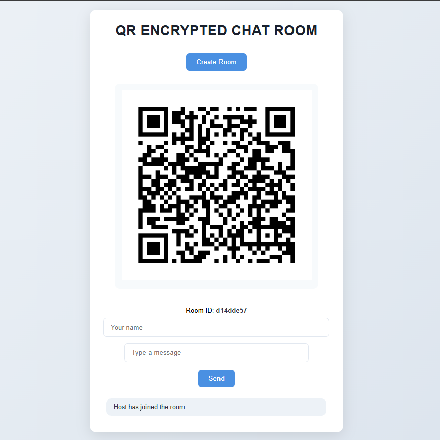

# 🔐 QR-Encrypted Chatroom

A real-time, secure chatroom where users can connect via QR codes. Messages are end-to-end encrypted using Fernet (AES).


## 🚀 Demo


---
## 🧪 Tech Stack

| Layer        | Technology                             |
|--------------|----------------------------------------|
| Backend      | [Flask](https://flask.palletsprojects.com/), [Socket.IO](https://socket.io/) |
| Realtime     | [Flask-SocketIO](https://flask-socketio.readthedocs.io/en/latest/) |
| Encryption   | [cryptography.Fernet](https://cryptography.io/en/latest/fernet/) |
| QR Code      | [qrcode](https://pypi.org/project/qrcode/) |
| Frontend     | HTML, CSS, JavaScript                  |
| Concurrency  | [eventlet](https://pypi.org/project/eventlet/) |

---
## 🛠️ Setup

```bash
git clone https://github.com/DanielWill-1/QR-Encrypted-Chat-Room
cd qr-chatroom
pip install -r requirements.txt
python app.py
```
---

Usage Example
Create Room
On the homepage, click “Create Room”. A QR code and invite link will be generated.

Join Room
Open the link on another device (or scan the QR). You'll both be redirected to a secure chatroom.

Chat Securely
All messages are encrypted client-side using Fernet before being sent over the socket.

Decryption
Messages received in the room are shown in encrypted form. You can decrypt them using the Decrypt button (using the same key).

---

How It Works
A random Fernet key (AES-128) is generated per room.

This key is shared via the URL embedded in the QR code.

Messages are encrypted with this key using cryptography.Fernet.

Server only transmits ciphertext — it cannot read your messages.

---

Pull requests are welcome! Feel free to open issues or submit feature requests.

---